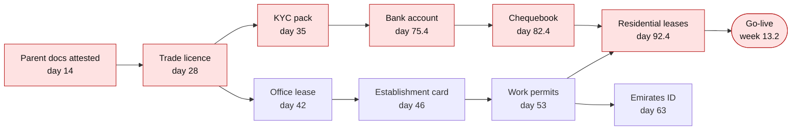
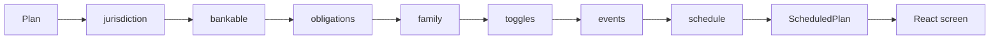

# Landing Sequence

**The critical path for moving a company and its people to Abu Dhabi.**

Abu Dhabi issues a trade licence in about 6 minutes and a work visa in about 5 days. A relocating company is still not operational for about 13 weeks. Every step is fast. Nobody owns the order.

Landing Sequence builds one dependency graph for the company and every relocating person, computes the critical path and the go-live date, scores bank-account readiness, prices the hidden obligations in dirhams, and recomputes the date the moment you change a decision.

Hub71+ AI Hackathon, 2 October 2026. Team Visionary.

| | |
|---|---|
| Live demo | added at submission, no login needed |
| Pitch | `/` |
| Product | `/app` |
| Run locally | `npm install && npm run dev` |

## The problem

Demand is not the bottleneck. New economic licences grew 29% in 2025 and ADGM operating entities grew 43%. The bottleneck moved to absorption: the private steps after the licence, and the obligations nobody warns you about.

| Number | What it means | Source |
|---|---|---|
| 6 min | to a trade licence | TAMM Investor Journey |
| 5 days | to a work visa | Work Bundle, MoHRE and ICP |
| 2 to 6 weeks | to a corporate bank account, about 30% rejected first time | Meydan FZ; UpperSetup 2026 |
| 1 to 4 | post-dated cheques per lease, and no chequebook for weeks after arrival | The National |
| 0.1% | prime office space available | Cushman & Wakefield Core, Q3 2025 |
| AED 9,000 | per month per unfilled Emirati role, mainland firms with 50+ skilled staff | MoHRE, 2026 |
| 6 to 12 months | advised lead time for a school seat | ISchoolAdvisor 2026 |

Everyone else builds a checklist for one person. Companies move as a graph. The licence gates the visa file, the bank gates the chequebook, the chequebook gates every lease, the office floor area gates the visa quota, the school year group gates the family. The value is in the edges.

## What it does

- **One graph, one date.** A deterministic schedule for the company and each person, with the critical path marked and a go-live date you can plan payroll around.
- **Bankable.** Twelve questions set the bank's rejection risk and review time, and list the documents that are missing.
- **Hidden obligations in dirhams.** Emiratisation checkpoints, corporate tax registration and licence renewal, each with its date and its cost.
- **Three decisions you can flip.** KYC in parallel, direct-debit rent, a flexi-desk visa file. The date moves while you watch.
- **Language where language is needed.** Read the documents, explain any step in English and Arabic, draft the paperwork, and turn a plain what-if question into plan edits.

## The result on a worked case

Preset A is Northline Payments, an ADGM company relocating 12 people.

| | Baseline | With a complete bank file and all three decisions |
|---|---|---|
| Bank review, median | 32 days | 23 days |
| First-time rejection risk | 30% | 12% |
| Bank account open | day 75.4 | day 54.4 |
| **Go-live** | **week 13.2** | **week 7.8** |

The baseline critical path, with the day each step finishes:



The people are ready by day 63. The company waits another month for a chequebook. That gap is the product.

Preset B is Gulf Reach Logistics, a mainland company with 60 staff, 50 of them skilled. It surfaces what a free-zone checklist never shows: 5 Emirati hires or AED 45,000 a month, and a corporate tax registration deadline on day 107.

## How it works

The logic is pure. Each module is a function `(plan) => plan`, and the pipeline runs them in a fixed order on every change. React only renders the result.



- **Schedule.** Kahn topological sort, expected durations, longest path, critical path and the keystone step. A dependency cycle is an error, not a guess.
- **Expected duration, not best case.** A bank account takes `median + rejection risk × retry`. For Preset A that is `32 + 0.30 × 28 = 40.4` days, which is why the date is one you can plan around.
- **One state.** A single `useReducer` holds the `Plan`. Change a toggle or an answer and the whole schedule recomputes.
- **Frozen contracts.** `src/model/plan.ts` and `src/ai/schemas.ts` are the two files nothing else may bend.

## Where OpenAI is used

The model does the language. The engine does the dates. The model never invents a duration.

| Call | Goes in | Comes out |
|---|---|---|
| `POST /api/extract` | Trade licence, MOA, offer letters, as PDF or image | Company facts and the relocating people, with evidence quotes and a confidence score |
| `POST /api/explain` | One step of the schedule | Why it matters, in English and Arabic, and what to do today |
| `POST /api/draft` | A template and its context | Bank cover letter, employer rent guarantee, school application or landlord direct-debit proposal, bilingual |
| `POST /api/whatif` | A question in plain words | Plan edits only: toggles, answers, zone, headcount, events |

- Built on the OpenAI Responses API with structured outputs. Every request and response is validated against the zod schemas in `src/ai/schemas.ts`.
- Server-side only. The key lives in a Vercel function and never reaches the browser.
- It degrades in the open. If a call fails or times out, the client falls back to deterministic mocks and the screen shows a `Demo mode` pill.

## Run it

Needs Node 20 or later.

```bash
npm install
npm run dev        # pitch at http://localhost:5173, product at /app
npm test           # Vitest
npm run lint       # tsc --noEmit
npm run build      # type check, then production build
```

The app runs with no key, in demo mode. For live AI, copy `.env.example` to `.env`:

```bash
OPENAI_API_KEY=            # server-side only
OPENAI_MODEL=gpt-4.1-mini  # pinned model for structured outputs
```

Deploy target is Vercel: framework Vite, root `/`, the `api/` folder as serverless functions.

## Project layout

```
api/              serverless functions: extract, explain, draft, whatif
src/model/        plan.ts, the frozen data contract
src/data/         steps, banks, zones, obligations, presets, each duration with its source
src/modules/      jurisdiction, bankable, obligations, family, toggles, events
src/engine/       pipeline and schedule, with their tests
src/ai/           schemas (frozen), client, mocks
src/views/        the product screen at /app
src/pitch/        the pitch site at /
docs/             venture case, review of prior art, demo script
```

## The data

Every duration in `src/data/` carries a source string, shown on the bar it belongs to. A number changes only with a source.

- Published ranges, cited: bank review times, visa processing, rent indices, vacancy, Emiratisation and tax rules.
- Our relocation survey: days to Emirates ID, bank account, lease and school seat from people who moved in the last two years.
- Nova Real Estate leasing medians: days from enquiry to Tawtheeq, cheque counts, share of deals needing an employer guarantee.
- School availability calls: FS1, Year 3 and Year 7 by curriculum.

## How it was built

Three OpenAI Codex sessions built it in parallel against frozen contracts, with strict file ownership so the merges are mechanical. `AGENTS.md` is the brief each session read first.

| Pack | Branch | Owns |
|---|---|---|
| A, engine | `codex/engine` | `src/engine`, `src/modules`, `src/data` |
| B, screen | `codex/screen` | `src/views`, `src/App.tsx`, styling |
| C, AI and pitch | `codex/ai` | `api`, `src/ai/client.ts`, `src/ai/mocks.ts`, `src/pitch`, docs |

## Honest limits

- Durations start as medians from published ranges plus our own survey. They become defensible only with volume.
- Banks may not publish decisions. Applicants report outcomes in exchange for the free plan.
- This is a planning tool. It does not file applications or give legal, tax or immigration advice.

## More

- `docs/PITCH.md`: the venture case, who pays and why.
- `docs/REVIEW.md`: prior art, and what we took from it.
- `docs/DEMO_SCRIPT.md`: the three-minute demo.
- `AGENTS.md`: architecture, ownership and the worked numbers.

## Team Visionary

[@Kazemkhani](https://github.com/Kazemkhani) · [@muslimbarahooe007-max](https://github.com/muslimbarahooe007-max) · [@safwanmohiuddin-droid](https://github.com/safwanmohiuddin-droid) · [@ahmedrazagit](https://github.com/ahmedrazagit)
